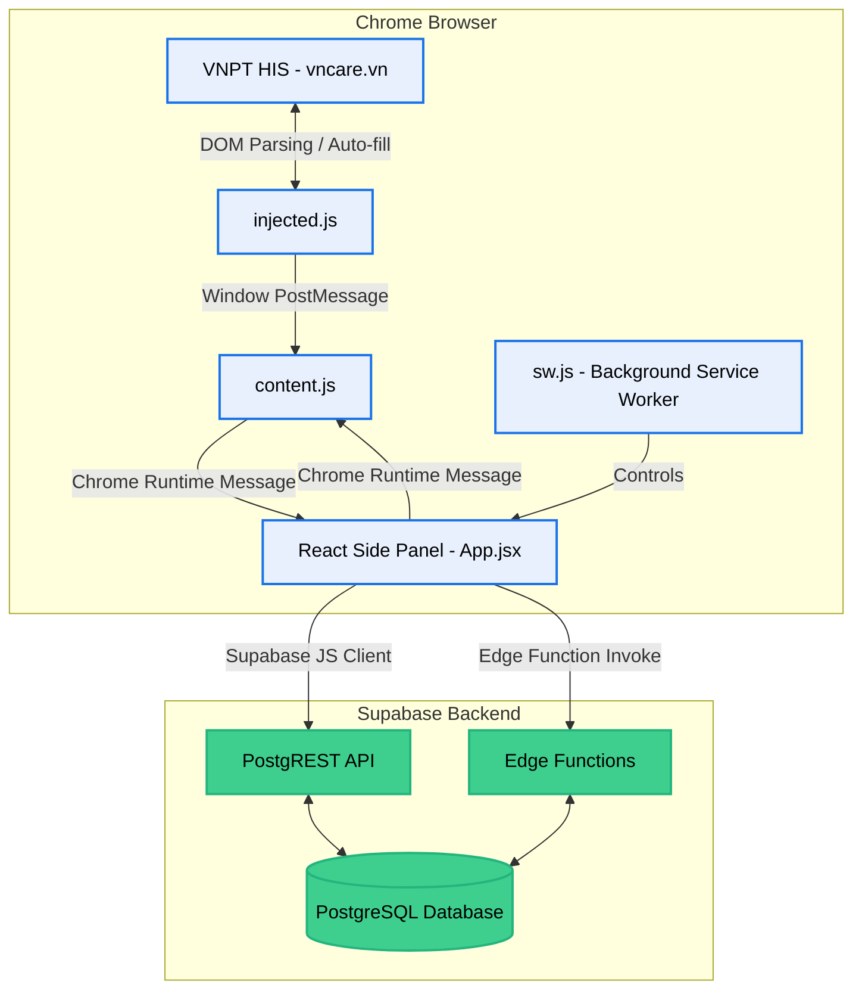

# Aladinn OASIS Architecture Map

## Overview
Aladinn OASIS is a Chrome Extension designed to manage and schedule internal surgeries ("Bảng dự kiến mổ nội bộ"). It operates as a side-panel application that integrates directly with the VNPT HIS system (`vncare.vn`). The extension acts as a bridge, extracting patient and diagnostic data directly from the hospital's web interface and allowing medical staff to schedule surgeries via a rich, React-based drag-and-drop board. The backend is powered by Supabase, providing real-time data synchronization, a PostgreSQL database, and secure edge functions.

## Architecture Diagram

## Blast Radius Matrix

This matrix outlines the impact of changes made to key components within the Aladinn OASIS ecosystem.

| Component / System | Description | Affected Downstream Systems (Blast Radius) | Risk Level |
|--------------------|-------------|--------------------------------------------|------------|
| **VNPT HIS DOM Structure** | The hospital's website UI (`*.vncare.vn`) which the extension interacts with. | **`injected.js`, `content.js`**: DOM parsing logic will break if the HIS UI changes, preventing data extraction or patient profile auto-navigation. | **CRITICAL** |
| **Supabase Database Schema** | PostgreSQL tables (`surgeries`, `surgeons`, `operating_rooms`). | **React UI (`useSurgeries.js`), Edge Functions**: Changes to column names, types, or relations will break data fetching, creating, and updating on the UI side. | **CRITICAL** |
| **`useSurgeries.js` Hook** | Core React state management for surgeries and Supabase real-time sync. | **`Board.jsx`, `TableView.jsx`, `WeekCalendar.jsx`**: Changing this hook affects all main views, data rendering, and drag-and-drop state updates. | **HIGH** |
| **Edge Functions (`encrypt-proxy` / `oasis-surgery-api`)** | Handles sensitive data proxying and API requests. | **Data Security & Integrations**: Changes here can fail API requests or expose/break sensitive patient data pipelines. | **HIGH** |
| **Auth & Sessions (`useAuth.js`, `editSession.js`)** | RBAC, Passcode validation, and session unlocking logic. | **Data Mutations (`Board.jsx`, `SurgeryModal.jsx`)**: If broken, unauthorized users might edit the board or authorized users get locked out from making changes. | **HIGH** |
| **Drag & Drop Logic (`Board.jsx`)** | `@hello-pangea/dnd` implementation for assigning surgeries to shifts. | **Scheduling Engine**: Bugs here will misallocate surgeries to wrong shifts or disrupt the ordering priority. | **MEDIUM** |
| **Readiness Engine (`lib/readiness.js`)** | Evaluates if a surgery has all required preparations. | **UI Warnings (`Scheduler/ConflictWarning.jsx`)**: Changes affect visual indicators and confirmation dialogs before scheduling. | **MEDIUM** |
